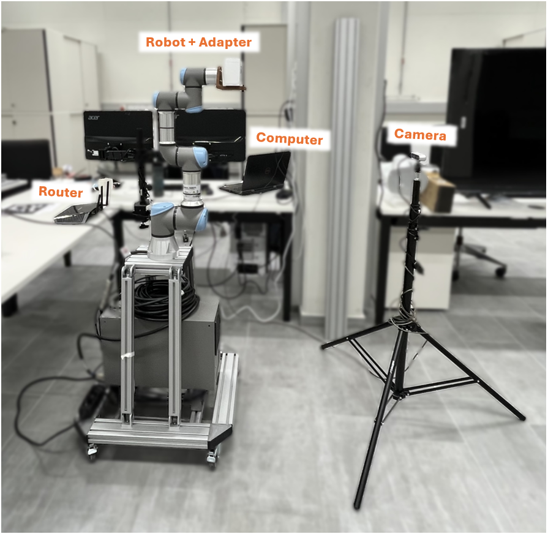

# 6D Pose Estimation: A Comparative Study of ArUco and FoundationPose

This repository contains the source code and experimental setup for a Bachelor's thesis project that implements and evaluates the accuracy of two distinct 6D pose estimation methods:
- **Marker-based**: ArUco approach
- **Marker-less**: FoundationPose model

## 📌 Overview

The core of the experiment involves using a **Universal Robots UR3e** robotic arm to provide precise ground truth data. The robot moves a test object through a predefined 3D grid while a camera captures the scene. The system compares the estimated poses from the vision models against the robot's known poses.

---

## 🖼️ Visual Overview

### Experimental Setup

The setup includes:
- **UR3e robotic arm**: Holds the test object.
- **Intel RealSense D435i**: Captures RGB-D data.
- **Computer**: Controls all processing.
- **LAN Router**: Enables communication between components.

> 

---

### System Architecture & Communication

- A **main Python script** orchestrates the flow.
- **TCP/IP via RTDE** handles communication between the PC and UR3e.
- **Local sockets** handle communication between Python processes.

>  
>  

---

## ⚙️ Hardware & Software Requirements

### Hardware

| Component        | ArUco               | FoundationPose         | Purpose                              |
|------------------|---------------------|-------------------------|---------------------------------------|
| Robotic Arm      | UR3e                | UR3e                    | Ground truth generation              |
| Camera           | Intel RealSense D435i | Intel RealSense D435i | Image & Depth data acquisition       |
| Computer         | i7-7700HQ, 16 GB RAM | i9-10850K, 128 GB RAM  | Data processing & model inference    |
| GPU              | GTX 1060            | RTX 3090 (24 GB VRAM)  | Model training & inference           |
| Network          | LAN Router          | LAN Router             | PC ↔ Robot communication             |

### Software

- **OS**: Windows 10 (ArUco), Ubuntu 22.04.5 LTS (FoundationPose)
- **Python**: 3.10 (via Anaconda)
- **Libraries**: `OpenCV`, `NumPy`, `rtde-client`
- **Virtualization**: Docker (required for FoundationPose)

**Dependencies:**
- NVIDIA Drivers & CUDA Toolkit (12.1+)
- FoundationPose, BundleSDF, and SAM repositories

---

## 🔧 Setup and Installation

### Hardware Setup

1. Assemble hardware as per *Figure 1*.
2. Connect the computer and UR3e to the same LAN.
3. Assign static IPs (as per the thesis or router config).
4. Ensure the PC can ping the robot.

### Software Setup

```bash
# Clone the repo
git clone <this-repository-url>

# Create and activate a virtual environment
conda create -n pose_env python=3.10
conda activate pose_env

# Install required packages
pip install opencv-python opencv-contrib-python numpy
pip install rtde-client rtde-receive
```

### Docker (for FoundationPose)

- Install Docker and NVIDIA Container Toolkit on your Ubuntu machine.

### UR3e Configuration

Copy the following files from the `UR3e/` folder to a USB drive, and load them onto the UR3e control panel:

- `rtde_control_loop.urp`
- `control_loop_configuration.xml`

---

## 🧠 FoundationPose Model Setup

Follow the installation guides from:
- [FoundationPose repository](https://github.com/autonomousvision/foundationpose)
- [BundleSDF repository](https://github.com/autonomousvision/bundlesdf)
- [Segment Anything Model (SAM)](https://github.com/facebookresearch/segment-anything)

---

## ▶️ Running the Experiment

### Step 1: Camera Calibration

```bash
python gen_pattern.py  # Generates checkerboard.svg
```

1. Print `checkerboard.svg` on A4 paper.
2. Attach to the UR3e end-effector.
3. Run `calibrate.py`, move robot through 15–20 poses.
4. Press spacebar to capture, ESC to finish.
5. Calibration file is saved to `calibration/`.

---

### Step 2: Data Collection

```bash
python run_pose_estimation.py
```

**User Interface Prompts:**
- Pose Type: ArUco or FoundationPose
- Robot IP
- ArUco tag type (e.g., `DICT_7X7_50`) & size
- Object name

**Automated Scripts:**
- `generate_aruco_tags.py` (if ArUco selected)
- `ur3e_control_loop.py` (launches robot control)
- `pose_estimation.py` or `foundation_pose.py` (based on method)

### Start Robot

On the UR3e panel:
- Run the `rtde_control_loop.urp` program and press **Start**.

The robot executes 351 reference poses and triggers the PC for each.

---

### Step 3: Data Output

#### ArUco

- Output: `.jpg` images
- Filename includes both ground truth and estimated pose:

```
pose_estimation/{object_name}/{object_name}_{ground_truth_pose}_{estimated_pose}.jpg
```

#### FoundationPose

- Output: `.json` log with timestamps and ground truth poses:

```
pose_estimation/{object_name}/{object_name}.json
```

---

## 🧾 Code Description

### `run_pose_estimation.py`

Main orchestrator that:
- Launches UI
- Calls calibration scripts
- Starts robot control and pose estimation

### `pose_estimation.py` (ArUco)

- Captures images on robot triggers
- Estimates 6D pose with OpenCV ArUco
- Saves frames with ground truth and estimated data in filename

### `foundation_pose.py`

- Logs timestamp and ground truth pose from robot
- Saves to `.json` for offline FoundationPose evaluation

---

## ⚠️ Known Issues

- There is likely an issue with the **calculated rotated positions** at the reference points. These may not accurately reflect the intended orientations and could affect evaluation metrics for both methods.

---
